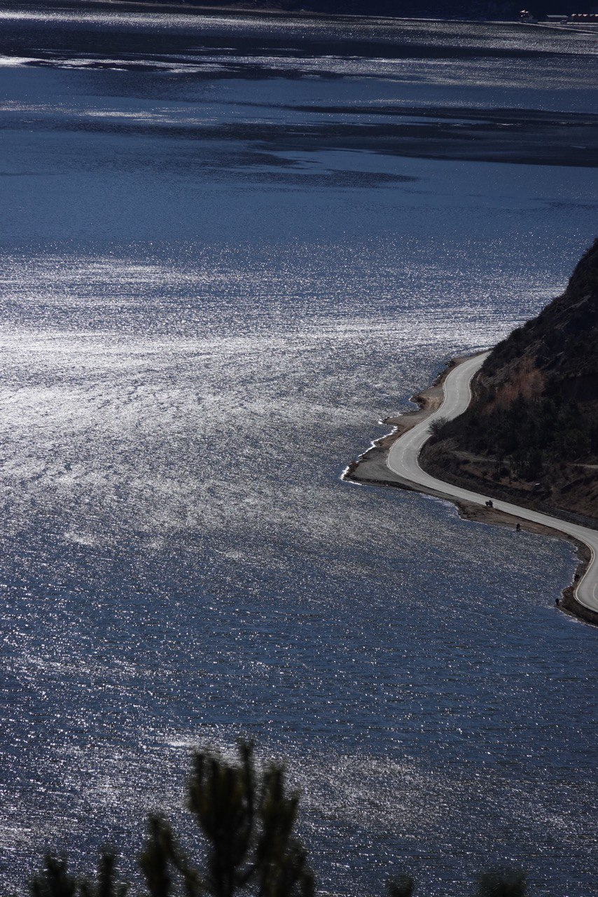
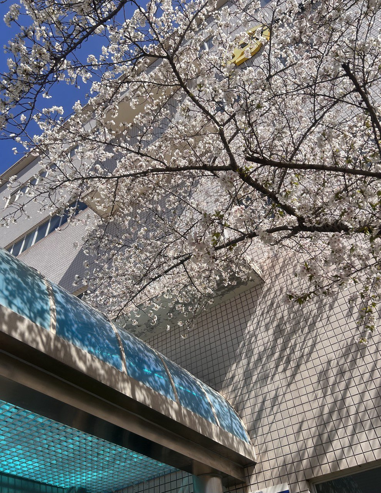
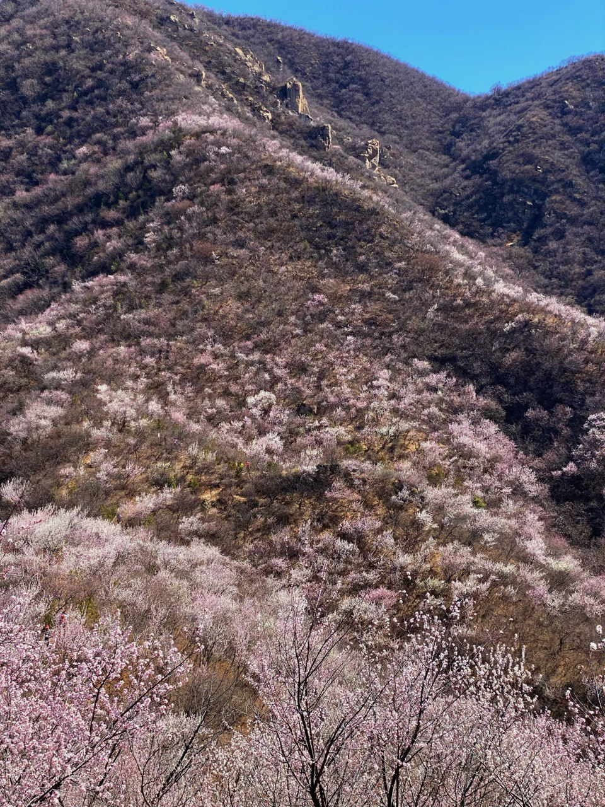
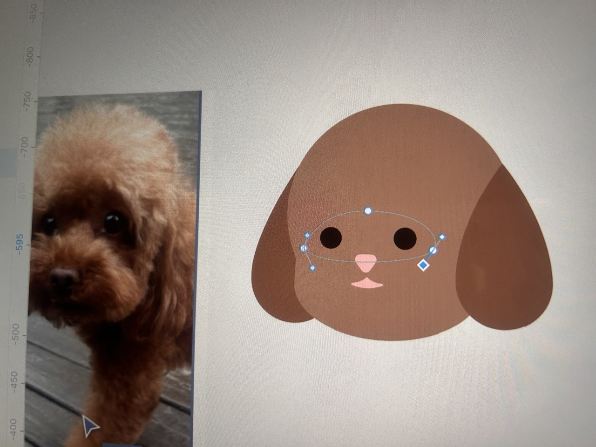
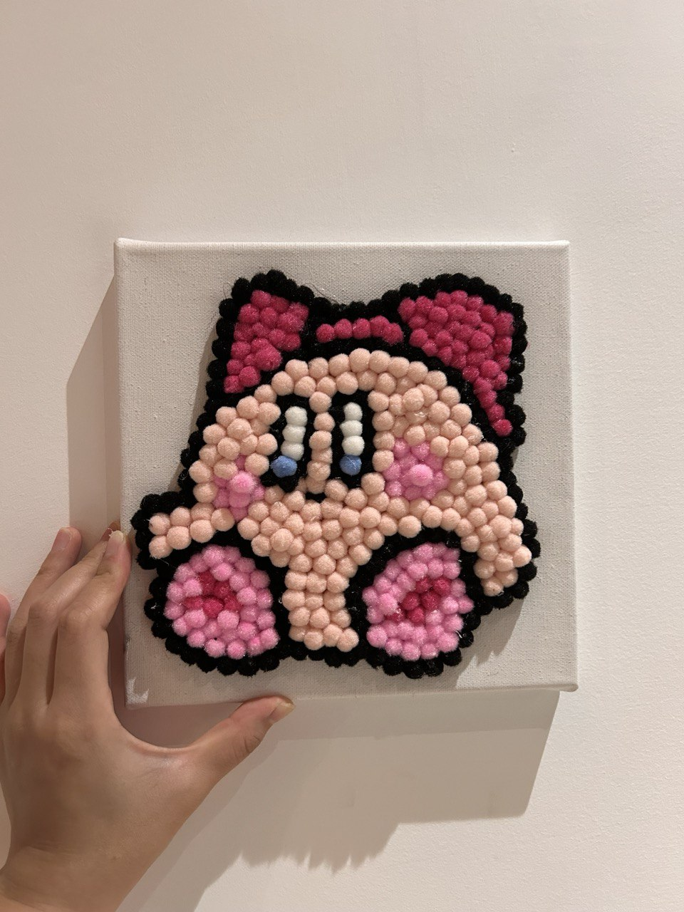
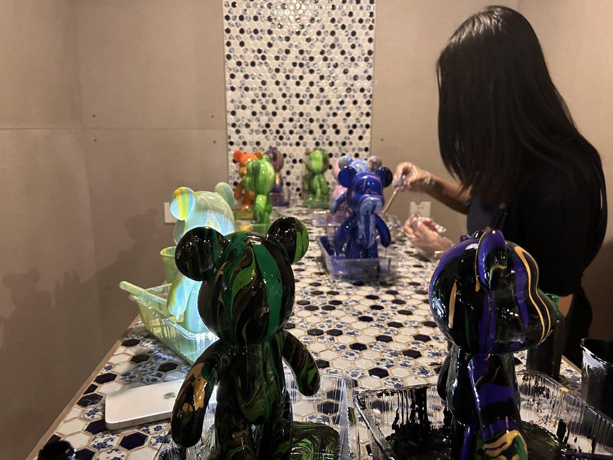
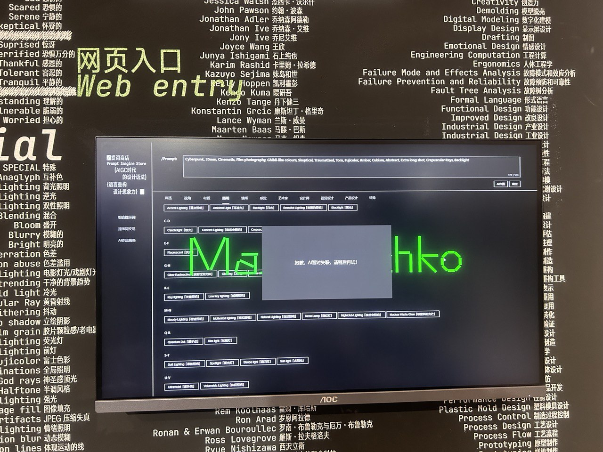
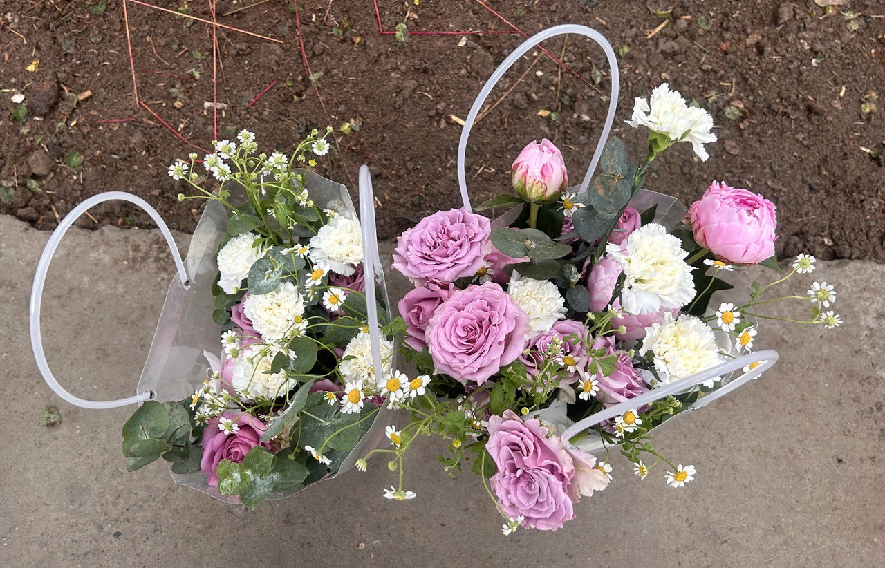
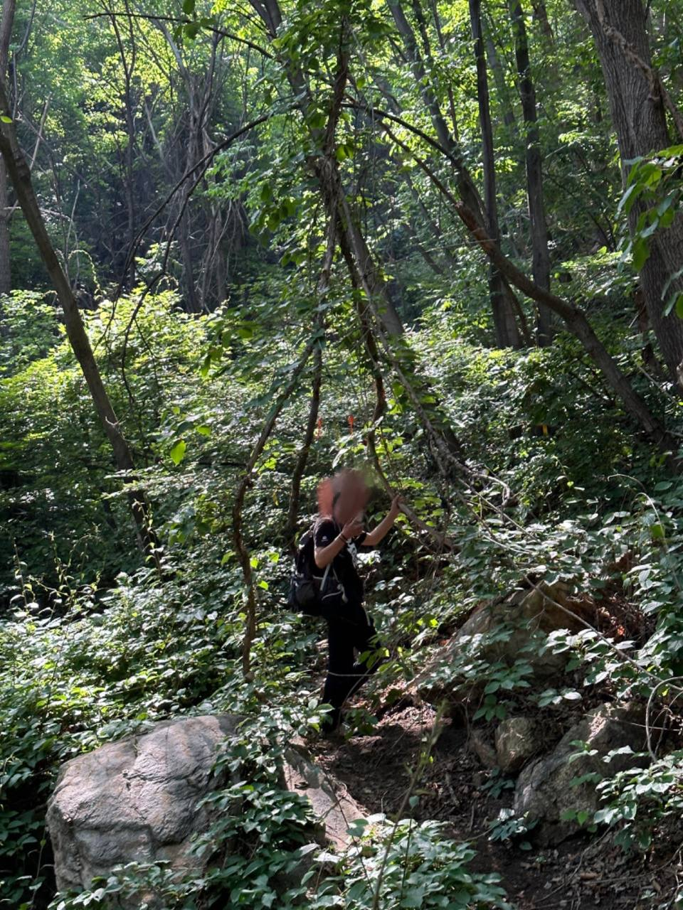
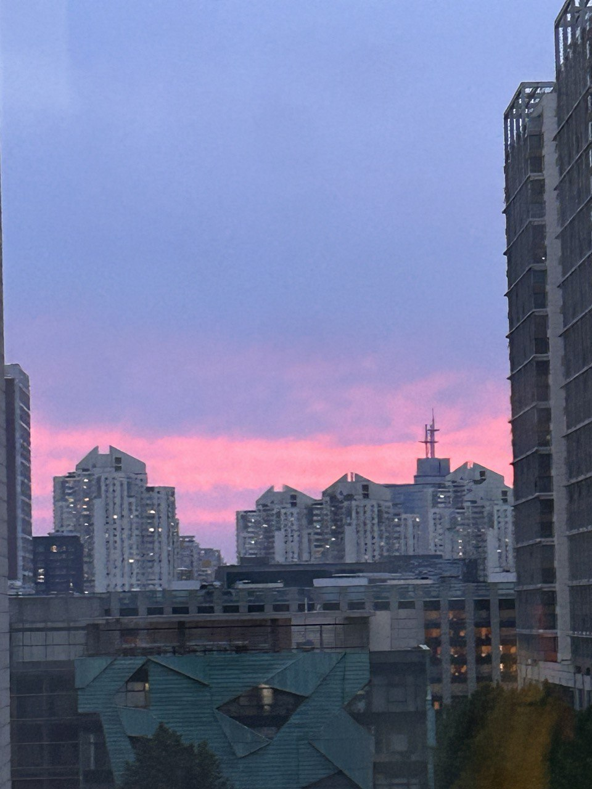

我猜 50 年后如果还活着，回顾起陈年往事应该会觉得 2023 是我生命中比较重要的一年吧。前几天在公司内网填年度个人总结，好像并想不起来具体做了什么，于是打开 github 一个格子一个格子地点开看，有时很绿，有时很浅，从里面摘抄有内容的写。现在也是一样，我没有太多记录的习惯，许多当时的心境想不起来了。只是这次打开的不是 github 而是相册，试图找回一点点记忆。

## 一月

1 月元旦，新冠还没完全好，心脏时不时隐隐作痛，但固执地跟着几个同事去了雨崩爬山。虫草线那天的记忆犹新，人生第一次站在 4500 海拔的地方吧，在山顶被赠予一颗枇杷润喉糖，眼前的清爽和喉咙的清凉混杂让一种奇异的感觉袭来。下山后在客栈大厅和路上同行的人凑了一大桌子吃饭，被安利了尼泊尔 EBC。有机会的话还想去一趟。

## 二月

2 月份应该是回家过年，我表现得很乖，大概没有和家里吵架。和高中宿舍几个人一起吃了饭，感觉没太多想说的，有循规蹈矩，也有出乎意料，大家都在各自的人生轨迹上慢慢努力着。没有什么特别印象深刻的东西了。回北京后重新和 z 出去玩，在雪后的香八拉遇到一个奇怪的不带手机不识地图的人，我们将近两年没有说话（her fault ! her fault!）但这次并没有觉得尴尬或奇怪，后面又自然而然开始联络，才知道她顺利的话毕业也要当前端，感觉在北京没那么孤独了。但我真的不喜欢这里。

## 三月

北京的春天很难得，我最喜欢了！正好园区里新开了一家瑞幸，大部分中午我取完咖啡会在樱花 / 梨花下面的椅子静坐一会儿，晒太阳，很舒服。戴着耳机感觉没人能打扰你，就是这样慢慢封闭自己的小世界的。

后面和大学有个朋友去望宝川看桃花，交流得知她现在在做信息安全产品的销售，笑说当年深恶痛绝的本科知识现在居然能为自己的职业助一把力作为背书，感慨着，我蓦地想起大二时她转专业失败我安慰她的那天。

与此同时，这个月有一个特别喜欢的同事彻底离职，舍不得，感觉在公司没乐趣了。 I’m so sad.

## 四月

在跟一名设计同事学习基础的设计知识，我教她 HTML + CSS + Javascript 三件套。感觉收获不少，虽然做起设计稿来动手能力很差，但至少能识别出一些基础的排版问题了，在工作中确实觉得很有帮助。也正好是我挺喜欢的事情，希望之后能再深入了解吧。

每周四下班后在大会议室上公司订的手工课，做了不少小玩意：毛球毡，项链，流体熊。做的东西不变，手笨这一点是从来没变过。是真的缺乏耐心。

## 五月

这个时节北京到处都是月季花，天气还没那么热的时候，去了央美看毕业展，在这里看到了一些口罩残存的证明。

去爬三峰，同行的人脚受伤了，走夜路到很晚，晚上回去后在六道口那家 《重山钵钵》吃串串。

公司行政组织了一次花艺课，坐大巴去昌平放松了一下午。花园里很多小动物，很多外国人带着小朋友，很多小朋友识小动物。不管是之前公司课程还是去做花艺，任何需要投入短暂时间的手工活我都无法很专注，要改。

## 六月

蹭同事的车去了椴树岭，一路上的视野像是《千与千寻》开头坐在后座上的千寻，在密密麻麻的丛林里穿梭。觉得有车会开车真好！

打《双人成行》，最开始觉得很好玩，后面有些审美疲劳。在咸鱼买的卡带，200 元入，180 元出。

## 七月

去走了东猴顶，夜路时大风大雨，天明后天气好些了。倒是不太累，就感觉后半程十分漫长，漫长得有些诡异。

过生日，收到了朋友花重金带我去 ktv 录音棚对唱的大礼包，喜欢。吃到了小猪佩奇蛋糕。

陷入一些情感问题，但我后来发现，不把对方看得很重要于我才是最奏效的。

## 八月

租的房子到期了，签合同后被难缠的新房东摆了一道，哭了很久。哎，遇到不讲理的人还是不知道如何应对。后又找了一套，房东和我事儿都不多，客厅望出去有一树的银杏叶，住起来很舒服。

因为搬到了 1 公里左右的地方，在咸鱼上买了辆二手捷安特，淡绿色车架很好看，就是冬天下雪的时候被我弄得有点脏。发现骑自行车上下班真的很放松心情。

## 九月

天气开始转凉，毫无存在感的九月，完全不知道自己干嘛去了。时不时心血来潮做饭，一锅乱炖居然也能很好吃，感谢我的叻沙酱和椰汁。

很多个周三都在吃达美乐披萨，不健康但是一周一次应该还好吧？

## 十月

国庆去了亚丁大转山，但没转完，感觉自己的生存能力又大幅提升，回来后写了 2w 字游记。从呷洛村里出发经机耕路去城里的那天，在车上晃晃悠悠，窗外是断壁悬崖，窗内放汪峰的《光明》，简直摇滚极了。已经开始期待下次了，有机会想尝试重装徒步。

回来后找了菲教上 15 个课时的口语课，以我的水平就是唠唠嗑都唠不明白的那种。选在每周一三五的上午九点半开始，25分钟理说应该很轻松，但我还是倍感压力。因为她会问你，How about your weekend? How about your work / life? 当我试图去认真回答时，总觉得日复一日的乏善可陈的生活没有可说的。但是老师的情绪价值很到位，一般课前我会略微焦虑，课后总是心情很好，15 个课时下来也确实感到有进步。

## 十一月

今年居然没有 happyday，可能公司穷疯了。怀念去年放开前和上文说很舍不得的同事一起做核酸大挑战的时候，当然，完全不怀念三天两检的日子。经历过才知道现在能“自由”地出行有多么难得。

看了部很喜欢的电影《稍微想起一些》，可能片名已经单独在我心里加了两颗星了。

体检还是那些问题，甲状腺结节，低密度脂蛋白胆固醇高，完全没有因为这些改变饮食习惯和作息。

赶在秋天的尾巴最后一次出去徒步，是在密云梨花顶，很好看。爬许多大石头，初级路线走出了高级路线的惊心动魄。

## 十二月

零零碎碎地就要过完 2023 了。

这个冬天真的好冷，下大雪后的那几天日常零下十几度，但还是没有养成戴手套的习惯，总是忘记，然后手被吹得饱经沧桑。打算去办护照，却因为身份证找不到一拖再拖。参加公司的拳皇 1997 比赛，拿了 4/8 名，获免费日历一套。有个十年的老同学从上海过来出差，抽空吃了晚饭。得知了一些带来小小震撼的事情，不过… 其实也不算什么啦。悄悄带她去参观了公司，在大 logo 前面用拍立得留念，看人像一点点从相纸上浮现出来。

在电影院看完了《涉过愤怒的海》，看哭。后来突发奇想下载探探把自己的 profile 设成周依然的生活照，和唯一认出来是她的一个体制内男生聊了大概两周，虽然每天都是有一搭没一搭的闲聊，但还是莫名感到压力。在迎接 2024 年的前一天，我跟他说“还是专注在现实世界比较好”，然后卸载了这个软件。
