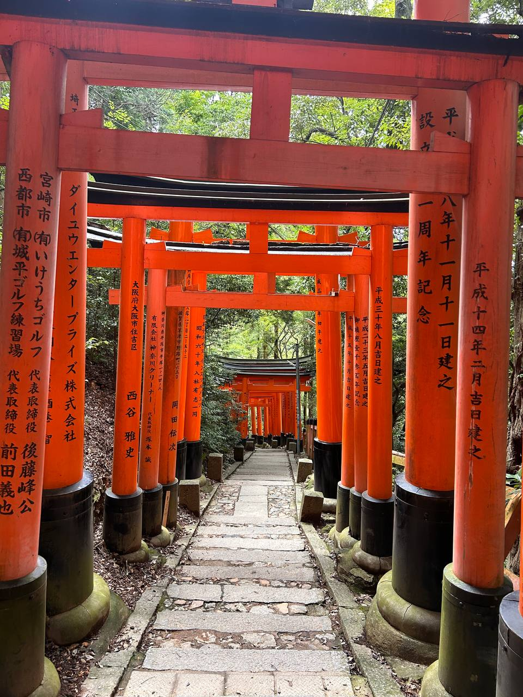

## 出发前

大概是4个月前就计划想去日本玩几天，当时日元跌得厉害，看了雅思价格考下来只要人民币一千出头，想着可以去顺便考一次雅思这样有种赚回来的感觉（不是）。先把签证办了，研究了许久因为钱不够办不了三年多次....毕业就快满三年所以需要去办北京居住证，我是一个完全的填表格苦手，因为这些事务性程序感觉挺烦的，好在最终办下来还算顺利。拿到的签证时间是 5/31-8/31，但是因为假期不足的原因一直拖着没有去，我也不知道当时为何那么着急办签证。

上上周的时候想起来签证快到期了，这个时候我看年假差不多也屯够可以请5天的假，所以当即买了去程的机票，极限操作买在了签证过期的当天，即8月31号，正好也是周六，剩下的什么也没买。出发前一天我才发现八月底正值台风“姗姗”登陆关西，我因为这个事情焦虑得不行。主要是天气可能导致我的飞机被取消或延误，延误的话我落地日本由于签证过期是可能被拒绝入境的，我不想承担这个巨大的风险所以不打算提前订返程机票以及酒店，可是不订返程机票的话出国内海关又会被问被拒绝出境，整个事态乱成一锅粥，我也不知道怎么办。

但是可能我沉迷于那种绝地求生的奇异感，以前经常极限操作好像也没有真的翻大车过。时而又会觉得这种极致的 p 人行为非常好笑，什么都准备得好好的算怎么回事，真的翻车了拿出去说也是一种经历，只能 “walk step, look step” 了。

## Day1 大阪

因为上述叠加的 buff 我在出发前一晚收拾东西到有点崩溃，心想要不就不去了吧去程机票反正非常便宜（国航从无锡转机只需要七百人民币），找人聊天一直拖延着转移焦虑，最终到凌晨三点的时候才睡着。第二天早上醒来似乎有种神性指引着我出发，就这样背着一个包打车去了机场。到达机场的时候距离起飞只有45分钟了，急匆匆跑去安检，还走了绿色通道，心想以后国内飞国内就都这么操作吧，不用排队安检真是太爽了...

到无锡机场的时候已经是中午了，这个机场很特殊，据说是一个军民两用机场，在起飞落地时不允许打开遮光板。在江浙地区特色便利店“十足”买了一个梅菜猪肉饭团，吃起来还行。这个时候我差不多确定不会延误了，在机场订大阪三天的青旅，一直等到无聊的下午四点过海关。

工作人员问我一个人出去旅游怎么想的，我心想一个人出去玩怎么了你管得着吗？但是嘴上很客气：很多人都一个人出去旅游呀。他解释说我的意思是你怎么安排的，盘问我有没有买回来的机票，我说没有，最终也没什么事儿。总之顺利通过了海关，晚上八点多到达了大阪，非常丝滑地完成了入境。没有被台风，也没有被签证问题影响，飞机上还幸运地换到了左右都没有人的位置，好好地睡了一觉，**第 n 次感叹我是如此幸运**。

大阪这几天都宿在难波附近一家青旅： [Namba Guesthouse HIVE](https://www.agoda.com/en-ca/qoo-hostel-osaka/hotel/osaka-jp.html)，是在无锡候机的时候选的，三天晚上只需要 461 人民币，还附带一个小桌子，超值 TT，天知道这样一个桌子可以多大程度提升住青旅的幸福感。是我在日本待的七天住的最舒适的地方。

以上是印象比较深刻的到达前的事情，后来开始玩儿了在各个地方转动并没有细致的记录。由于本人不具有整理成文的能力，重新去回想当天的路径也稍显困难，下面就都是一些碎片化的记录了，可能会不连贯。

## Day2 京都

很困，上铺似乎没有住人，所以昨夜睡得很好，这个青旅提供的耳塞大小很适合我的耳朵，不会涨耳也不会掉。楼下便有一个地铁站，看了眼地图去京都需要转两次，还不是很熟悉日本电车线路，上网紧急学习了下，然后出发了。

大概十点多到京都那边，但是下错站了，从四条还是七条站出来，发现距离并不是很远，打算一路步行至伏见稻荷。在路上拍了许多居民区的照片。

在人群中发现有个人长得好像吴慷仁，惊觉吴慷仁这种长相确实是和日系有关联呀 (?) 图文无关

一条铁路穿过居民区，我站在铁轨中间拍照。没隔一会儿站台处发出滴滴滴的警报声，我还以为触发了什么警报，赶紧跑出去。然后两根杆子降下来，原来是一辆列车行驶过来了。穿越时空少女里面女主被火车撞的那个场景在我印象中非常深刻，现在那个画面终于具象化。

在稻荷神社猛爬，不看路地猛爬，乌云密布，有种金三顺爬汉拿山上身的感觉。这个景点最初人很多，但是到后山上，走到后面就几乎没什么人了，所以可以抓拍到许多无人的照片。

我把护照随意地塞在相机包里，走路上来来回回塞取相机的时候，路过一个中国人提醒我好几遍：护照会掉护照会掉。后来又去了清水寺，二三年坂，没有印象特别深刻的。晚上在梅田商圈瞎转悠，因为下雨了并没有逛得特别好，只是被其扭蛋机丰富程度所震惊。

## Day3 奈良&宇治

昨天走了三万多步，还在情感上拉扯了一些问题。感到身心俱疲，这让本来打算今早睡到八点就起来出门去奈良宇治的我最终断断续续睡到快十一点，然后终于起来了。昨日在外面摸索了一天，今天好像已经学会坐日本地铁了。跟着谷歌地图看站台和时间就可以，然后再注意一下 station 的名字。

在宇治河边拍了一些好看的照片，商业街点了抹茶拿铁喝，吃了抹茶饺子，权当打卡意思意思了。宇治神社一块祈福牌上写着繁体：在人生路上，绕远路也没关系，只求顺利，能够以自己的步调到达目的地。 字迹很沉稳，内秀。因为“No photos”我就没有拍下来了。本来打算在宇治随便看看就出发去奈良，但是走到那座静谧的大吉山入口就忍不住一直爬上去了，是蛇形的松软土路，森林非常茂密。没什么人，几乎都是当地的老人小孩在爬，回来后我做功课才发现这座山有在《[吹响悠风号](https://movie.douban.com/subject/26169716/)》里出现，作为圣地巡礼的一角。山上还碰到老师（？这应该叫什么职业）带小朋友出来爬山 ，叽叽喳喳超级萌!

又半个多小时坐电车到奈良。电车上正好碰上日本初中还是高中生放学了，好青春洋溢哦！他们放学可真早。到奈良站后出站走十多分钟便可以到奈良公园，开放式的不需要门票。越往里走渐渐地鹿越来越多，有的社恐鹿躲在花台里，有的会大胆到你身边转悠要鹿饼吃。

坐在台阶上像《濑户内海》里那样什么也不想，就静静地看着眼前就好了。在小鹿，湖水和夕阳的陪伴下太过治愈，爱上奈良这个地方了（看火影忍者最喜欢的角色也是奈良鹿丸 T^T）。可惜因为这次时间安排不够合理，早上出发太晚以及在宇治逗留太久，没法去爬若草山，下次来一定去看看。

从奈良回大阪市区的路上，抱着一盒开封的牛奶飞奔冲进电车，然后撒了一些到手臂上，右边长得像韩国人的日本男生敏锐地观察到了，并主动在包里摸索出一张纸巾递给我 🥹 他好像说的是 “sensei” （到底昵称应该是什么）。然后逛了难波商圈，心斋桥道顿堀什么的，不得不说这真是我目前看过的最热闹最丰富的商圈了。在一家帽子店买了两顶帽子，支出三百+人民币，虽然帽子上赫然写着 made in China ，我去淘宝看肯定能找到一样的价格更便宜的，但是就这样吧...

晚上回来去找旅店老板付昨天晚上的洗衣+烘干费用，因为昨晚没现金且过了可以刷 visa 卡的时间了，他笑眯眯说了好几遍 ok ok，我心说那就到前台去让我支付呀！然后他又用翻译器跟我说： you don't have to pay 。 欧！虽然不知道为什么但是阿里嘎多！

洗完澡就试图订东京的酒店到凌晨，我好后悔没有早点订，现在的价格好贵。 (˃ ⌑ ˂ഃ ) 不过 p 人还是不会长记性的，可能东京的住宿就是贵吧。

## Day4 浅草寺&秋叶原&银座

昨晚还是没把住宿定下来，今早上醒来灵机一动把3-7号拆分成了两个时间段，大不了背上包换地方，定下来了比较便宜的价格，分别是一晚和三晚，而且在 Google maps 上评价都不错。在小红书上做的攻略是住在赤坂见附附近，我的第一晚 [WISE OWL HOSTELS RIVER TOKYO](https://www.agoda.com/wise-owl-hostels-river-tokyo/hotel/tokyo-jp.html) 在浅草寺，后三晚 [9h](https://www.agoda.com/en-ca/nine-hours-akasaka/hotel/tokyo-jp.html) 胶囊酒店在赤坂，价格分别是 126 元（是不是超级值的！） 和 637 元

突然想采访当时的自己，为什么在出发去东京的当天如此亢奋并发出了下面这样的感慨... （不过确实现在这个时代环游世界并不是什么太遥远的目标，探索世界的心情也是一直在的）

坐新干线太赶，我 11:08 买了 11:15 发车的票，我也不知道为什么异国他乡我第一次坐新干线不知道流程可以这么大胆，或许觉得既然日本人敢卖给我就说明这是具有可操作性的。于是匆忙之中进站的时候忘记拿票了。就是理论上我插进去它会在另一边吐出来，但我没注意，国内都用身份证坐高铁我怎么忘记了这回事。主要是买票机器总共给了我三张票，我完全没注意看每张上面写什么，还以为出站时会用到另外两张。

于是我火速寻找站台奔向列车的时候试图找座，发现我怎么并不知道我的座位号 🥵 发车了，我手里捏着票紧急找乘务员在那中翻日日翻中说明了原委，新干线列车上还比较空，感觉上座率只有一半。他先给我安排了一个座位，待会还不知道怎么出站。我只慌了一下然后就不慌了，先在座位上吃完了“成城石井”买的便当，特别美味！比定食适合我！一点都不咸。

吃饭的时候上小红书查绝望死了，说找不到票的话出站要再买一张，700块钱诶！赶上我东京四晚上住宿费了，绝对不再付一次，我哭爹喊娘地都不会再付。边紧张地刷丢票经历边吃便当，吃完后去找工作人员打算问问这到底怎么办，走到那里的时候他正在特别认真地填表，看到我他说别着急别着急（“jodemadei”，“jodemadei”），用翻译器告诉我站点已经找到票了，我瞬间释然，等了一小会，他交给我一张纸质收据让我出站的时候给工作人员看。可能也是日本社会真的太守秩序了，但还是**第 n+1 次感叹我是如此幸运** 。

到东京后正在下雨，我冒着雨从地铁走到青旅办理入住了，这个是一个酒店青旅混合式，二楼用于私人房间，一楼是青旅，房间里住的人不少，总体是不如大阪那个隐私性好和快捷方便的。明明昨晚睡够了，今天也没干什么，但是我累得快散架了。待会等雨小了出去逛逛，由于只在这里歇一晚上，明早还要十点之前办理 check out。

先步行去了浅草。上当受骗的感觉，怎么会有浅草寺这么无聊的地方（一秒回归国内商业街）和人形烧（不就是糖放得很多的红豆面包）这么名不副实的小零食。

然后转场去秋叶原，路边每隔五米一个女仆装小姐姐。又买酒喝了，需要在电子屏幕上点一下“我已经满20岁”才能买。喝着这听酒，晕乎乎地在秋叶原逛成人影像DVD店，耳边不时有呻吟声，这绝对是我人生中最奇妙的场景之一。

人在纸醉金迷的银座，天呐，为什么除了我所有人都这么有钱。

今天又勇敢了一回，洗完澡回到房间感觉味道怪怪的，似烟非烟似垃圾非垃圾（开始怀念大阪的绝佳青旅）。我再测试了一下确认确有其味就跑去前台找小姐姐（长得有点像可爱版的八木莉可子），先用英文说： I feel there are some strange smell in my room ，她好像有点迷糊，我再用翻译器给她说了一遍。然后她跟着我到房间，一开门就皱眉蹙鼻说： you're right! 好可爱的！ \_(:* ｣∠)_  她在房间走动了一下喷了点空气清新剂对我说： wait a minute 。我因为太累爬上床了，虽然这个味道似乎最后也没解决。

查攻略的时候某书上面说浅草住宿虽然便宜但是太远了，我今晚一看，即使去银座从我这出发也只需要二十多分钟呀！这算远？这算久？ 你怕不是从来没坐过北京地铁，东京出行让我觉得上天入地去哪哪都可以，北京地铁让我困在家里不想出门。今晚这个青旅就在如图晴空塔旁边，外观和环境是 ok 的，可惜住起来的体验不怎么样以及旁边有轰隆隆的电车声。

## Day5 东京市区闲逛

今天零碎地去了很多地方，六本木，代官山，芝公园+东京塔，国立新美术馆，原宿涩谷，代代木公园和歌舞伎町一番街。最喜欢是在代官山那一带的惬意，路上几乎无人，在交织的街道上上下下穿梭，随便走走就很舒适。

本来今天不再打算吃日本那些常见的定食，前几天拉面天妇罗来回吃得无一例外都很咸，今早上起来发现都水肿了。不过日本餐厅有一个好处是基本都会配备冰水，喜欢，比柠檬温水好许多。然而碰到一家外观很不错的餐厅发现好多日本工作党在吃，店里几乎没有外国人，我不死心地试了试结果还是很咸。明天！坚决！不吃！这！玩意！了！

可能是日光洒在耀眼的外墙上，在代官山路口远远地盯着一座发光的建筑出了神，我站着对它拍了许久... 突然好想住在这个街区。

晚上在歌舞伎町一番街，这里太过嘲杂、混乱和热闹，多站一会儿脑门要晕了，不是我应该待的地方。想起了在曼谷逛的那个红灯街区，不过风格还是有一些差异...

今天入住最后一个青旅，这个 9h sleep lab 没办法洗衣服，搜了一下附近的 laundry 贵死了！洗个衣服要六七十，我决定做一个挑战，每天晚上把身上这条速干裙子洗了现场吹干，身上穿他们发的那个统一制服（有种实验人的感觉），对这条裙子的速干能力非常有信心。脏衣服我直接带回家了。网上很多评价说不隔音，我个人感觉住起来体验其实还可以。入住的时候前台问我是否需要 sleeping quality report ，有点高科技的样子，我留下了邮箱信息但是快过去一周了都还没收到我的睡眠报告。

## Day6 镰仓

在东京没有定别的行程，箱根 / 富士山 / 横滨 / 伊豆 / ... 通通没打算去，唯一想去的就是镰仓。

去镰仓的 JO 线上坐错车位了，我下楼梯就径直走进一个车厢，发现里面座位非常宽敞，跟高铁一样有小桌板，还有二层。心想这么爽啊，就坐下享受了。隔了两站后一位日本小姐姐在车厢里来回走动，走到我身边的时候叽里呱啦说了一堆 #@&/ ，见我听不懂她又切换成英文，我盲猜是要纸票吗？ 我说用 suica 卡坐的，她说需要补票或者切换成普通席，哦◔̯◔ 原来这个好座位要额外加一半的钱哦。她说或者换成普通席也可以，我不想补票就跟着她走换成了普通座位，这里就和地铁差不多一样了。不管怎样享受了一会儿吧！

在电车上思考，一个人来日本旅游的最大好处是完全没有是别的地方的那种“上厕所焦虑症”，怕厕所难找，怕厕所脏，怕身上没纸，怕水龙头没水，怕突然肠胃出问题要等同伴或被同伴等。而且掌握了坐电车技巧后基本没有忧虑，不需要租车几乎不需要担心任何交通上的事情。

出镰仓站直接坐湘南电车，这个轨道很有意思，吊在空中在镰仓高高矮矮的建筑中来回穿梭，相当日漫。坐到了江之岛站，发现路线走错了，但是很不慌张地买了牛奶面包在海边静坐了吃完了早餐。小鸟，鸽子和我一起吃早餐。

每天都在即兴尝试新的路线然后即兴补救，有规划出行习惯的人出来跟我一起玩估计要焦虑死。吃完后发现路边居然有支付宝可以扫的共享单车，研究了一会儿成功沿着海岸线往回骑了五公里左右。骑车真是件太容易让人快乐的事情，那是我目前能接触到最迅速让人进入短时心流的方式，不会太累只是微微地出一点汗，眼前的景色不断变换，两侧的海风带来清爽。可惜镰仓海边的双车道公路给骑行者留下的空间并不多。

今天终于不磕定食了，在江之电镰仓站附近找了一家评分很高的美式汉堡店，意外之喜是店长看上去非常有气质，像日剧深夜食堂里的大叔。烈日下步行至长谷寺，这个庙宇处于一个精心小巧的小山包上，能从山腰上远远地瞥见镰仓海景，我纯属没什么目的为了避暑而来，到山上发现景色倒也不错。

从长谷寺出来之后乘江之电到镰仓高校前，确实不明白这里有什么好打卡的。于是歇了一站又直接坐到江之岛那里，继续爬石梯走到海边。镰仓的海是深蓝色的。

在海边的岩石堆乱爬，一个外国小孩叽叽哇哇也跑过来爬，他妈妈有点担心他，我跑过去搀他的手但他没理我，趁机拍了几张照片，爸爸在一旁教他“cheese!” 他乖乖对着镜头照做。然后我把照片 airdrop 给他爸爸，收获一句阿里嘎多。

离开海边岩滩，往回走的时候意外发现岛上有一片静谧无人的森林，小声放着悠扬的纯音乐。我一直沿着山路走，不时有两三行人，走到被围栏拦住的边缘见到惊喜的一景。

<video width="100%" height="auto" preload="metadata" autoplay loop muted playsinline >
  <source src="./jiangzhidao.mp4" type="video/mp4">
</video>

最后在离开镰仓前看到了落日余晖中的富士山。我恋恋不舍地拍了许久。

晚上发现月经又提前好几天来了，半夜出来买卫生巾，发现青旅一楼还一大堆人热闹着。月经是来日本玩后的第一个焦虑，上次去亚丁大转山也是提前，跟这几天外出暴走有关？幸好晚上睡不着起来上了个厕所，不然明早起来发现青旅床单被我睡红了我要崩溃，要不说塞翁失马呢。早知道我就长点心把月经杯带上了，心碎，心碎，以后还是不要对自己周期那么有信心。

## Day7 井之头公园 & 吉祥寺

经期不太舒适，昨晚也没睡好，在 daily 便利店买了一盒棉条，在 711 便利店的卫生间换了体感好多了。然后去了吉祥寺旁边的井之头恩赐公园，我喜欢这个名字！见到这个名字的第一眼我就决定要来看看。公园整体氛围意象和《世界奇妙物语》九零年代的剧集很像。

买了动物园的门票。

森林保留一些原始的土路，厕所看上去既卡通又很有年头。应该有很多周边的小朋友来玩，因为这是我第一次见一个地方小洗手台数量比大人要多的。

也可以再梦核一些。

在湖边的秋千荡了一会，下午在吉祥寺购物，很多的户外用品和精致古着店，深深感受到了自己的局限性（没钱）和物欲（很大）。

临到傍晚的时候还挺难过的，充电宝被摔坏快充不进去电了，断断续续的，手机仅剩10%的电量。日本人又不说英语，说的英语我又听不懂，我说的英语他们听不懂。地铁线路又复杂，没有认识的朋友在这儿。可是明天要回去了，要买的东西还没买到，现在还要坚持着去看一下。但是如果精心调整充电宝的接口位置，又能时不时供给一些电量，我就这样坚持完了一天。

晚上在赤坂见附地铁站的成城石井买一个便当，加热后拿着走到青旅一层，然后坐着把它吃掉。在便利店弄错了加热时间，加热过度饭盒都变形了，好烫。便利店阿姨看到了过来一边对我笑盈盈着解释正确的时间应该是多少，一边忍着烫帮我把盒饭仔细地装进塑料袋里，态度非常非常好。我心头一暖，不停地鞠躬说阿里嘎多。

## Day8 回

上午再去了一趟银座，逛那个两层大 montbell 买了一些衣服，在超市购入一些小零食，最后在 DAISO 买了个蛇皮口袋用于托运。丝滑！

事实真的和上面写的一样吗？完全不，基于我一贯的冒险精神，我认为那个充电宝还可以坚持到我回国我就没有买新的，于是在今天真实地吃了大苦头...... 离开银座后，本来打算在秋叶原买一个拍立得和行李箱，但是 Bic Camera 里卖的我认为价格不是很合适就没有买，出来后在路边巡视行李箱，虽然只要三百来块钱但是质量极差，拒绝购入这个行李箱。打算在零钱店 DAISO 买巨大的蛇皮袋来托运，反正也只是些不需要好好保护的衣服零食什么的。

结果秋叶原这家店卖光了，而此时已经到了我预估的出发去机场的时间，再晚一些就会不太保险。可是我现在没有托运的东西，坚决不给机场打包服务送钱。看了看出发去机场的路线，一个 skyliner，一个 SKYACCESS，后者要便宜将近一半的价格。我决定在这条路线碰碰运气看有没有哪个站点有比较近的 DAISO 可以买个大袋子。运气还真让我碰上了，在转车的 [Aoto Station](https://en.wikipedia.org/wiki/Aoto_Station) 就正好有一个距离很近的 DAISO，我飞奔出站跑进店里买了蛇皮袋又飞奔回站台，发现下一车次 SKYACCESS 还得等半个小时。手机这个时候也被折腾得仅剩 5% 的电，需要很仔细地调整充电宝的接口才能充进去。

这个时候我开始慌张，按照 Google Maps 的预估时间我坐上下一趟到 T3 就只有一个小时的时间要起飞了，之前没在国际航班到这么晚过，害怕柜台停止值机，害怕手机没电到自动关机。总之在那个电光火石的瞬间里我脑袋冒出太多想法，我要出站打车吗？好像也得一个小时，要转乘更快的 skyliner 吗？可是这个不能直接刷 suica 卡需要额外买纸票，我的时间禁不住这样消耗了。我也有点累了。下楼问问电车导航员有没有充电器可以借我用用？最终我还是留在青砥站这里，折腾了一会充电宝接口。查了查小红书到站之后极限冲刺应该是来得及的，而且据说日本春秋航空提前45分钟才会停止值机。感谢小红书。赌徒如我就抱着这样碰运气的想法，在站台煎熬，在电车煎熬，反正不管什么事都有“大不了”来兜底。

最终我顺利值机过安检回来啦。日本安检好宽松！**第 n+2 次感叹我是如此幸运**，可能这也是为什么我越来越不爱做计划的原因。

在返程的飞机上看完一篇社会学科幻文 《雪球效应》，里面实验的方法我并没有太看懂，那个选举过程和一步步如何走向壮大也说得挺模糊，可能国内外（还是中国和别国？）政治体制差别有点大，不过大概意思我理解了。还蛮喜欢这类非银河星战相关的科幻文的，之后可以多找些看看。

好喜欢飞机在天上侧旋转弯的时候，坐在靠窗的位置看机翼以三十度角倾斜，和大地天空形成落差，整个机舱缓缓在云层中转向目标轨线。好像我也张开了翅膀遨游。

## 回来后

北京在离开的这周入了秋，需要穿长袖长裤了。

整理东西的时候发现和以往每次出行都会丢东西一样，这次弄丢了一块相机备用电池 .... 总的来说一个人在日本游玩的体验是相当好的，体验不佳的地方基本都是因为我自己的折腾和作死。最喜欢的地方是奈良和镰仓，不知道下次再体验这样的闲适宁静是什么时候了。下次可以再多多体验别的地方，先预订箱根！强风吹拂！

最后，tomorrow is another day.

<video width="100%" height="auto" preload="metadata" autoplay loop muted playsinline >
  <source src="./tomorrow_is_another_day.mp4" type="video/mp4">
</video>
