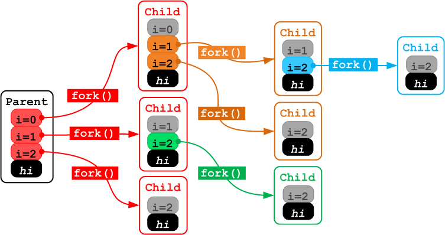
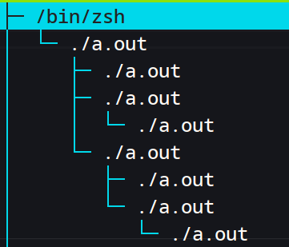
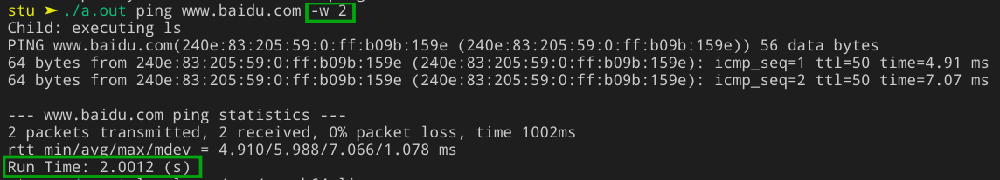
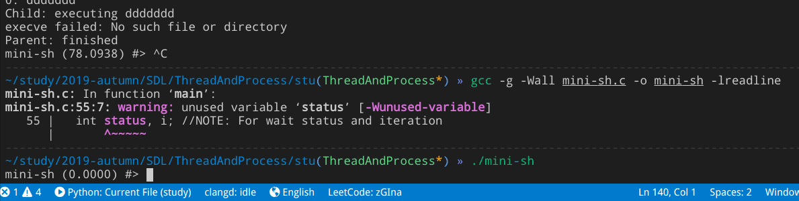
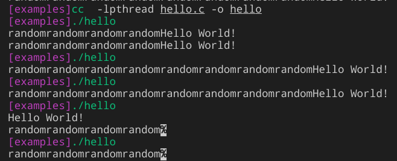
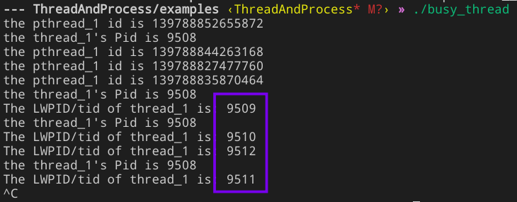
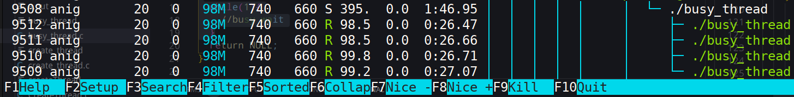

### Basic

- 进程是系统分配资源的最小单位
- 线程是处理机调度的最小单位

Linux 系统中，`进程`与`线程`的不像在 Windows 中特别区分，线程仅仅被视为一个与其他线程共享某些资源的进程，它们都被称之为`Task`（kernel data structure: task_struct）。下面从 Linux 系统中基本函数 `exec()`,`fork()`,`wait()`来分析 Linux 系统的进程管理，从 POSIX 标准分析线程管理。

### Process

进程创建：类 Unix 系统把进程创建分解到两个单独的函数执行：fork()和 exec()

#### `exec()`

读取可执行文件并将其载入地址空间运行

`man 3 exec`

#### `fork()`
  
在类 Unix 系统中，除内核进程(?)、init 进程(PID=1)以外，新进程都衍自系统调用`fork()`。

fork 函数很特别，返回两次，分别给父子进程返回 子进程的 PID 和 0， 若出现以下情况：① 系统限制`/proc/sys/kernel/pid_max` ② 内存/资源不足，则会 fork 失败返回-1。一旦父进程退出，子进程就被挂到 PID 1 下，所以可以看到很多父进程 PID 为 1 的进程。

- COW(写时拷贝)
  - 资源的复制只有在需要写入的时候才允许，在此之前以只读方式共享

以下是偷来的一个很助于理解该函数的[例子](https://stackoverflow.com/questions/26793402/visually-what-happens-to-fork-in-a-for-loop)

```C
#include <stdio.h>
void main()
{
   int i;
   for (i=0;i<3;i++)
   {
      fork();
      // getppid(): gets the parent process-id
      // getpid(): get child process-id
      printf("[%d] [%d] i=%d\n", getppid(), getpid(), i);
   }
   printf("[%d] [%d] hi\n", getppid(), getpid());
}
```

附图理解：



在`htop`中可以看到它漂亮的树型结构，父子进程关系是这样的



#### `wait()`

`man 3 wait`

#### [Task&Example](https://www.usna.edu/Users/cs/aviv/classes/ic221/s17/lab/07/lab.html)

- [`timer`](ThreadAndProcess-2019-11-13/time.c)

  - 要求是`接收命令及其参数在 shell 中执行，并输出 start、end 时间之差`

  在此例中，先`fork`生成一个子进程，在子进程中使用`execvp(argv[1], argv);`执行命令，父进程`wait`等待子进程的结束并计算时间。注意：

  - exec 从内存中加载程序并执行，从而**替换**了子进程
  - 所以选择在父进程中计时 end ，并 print 时间之差 diff (若在主程序会计时两次(fork~)

  结果如下：

  

  只要是按正常方式退出程序，即可以正确计时

- [`mini-sh`](ThreadAndProcess-2019-11-13/mini-sh.c)

  拥有了[`exec-fork-wait`](ThreadAndProcess-2019-11-13/exec_fork_wait.c)循环我们就拥有了一个 shell 所具有的最基本的功能！所以可以来制造一个 mini-shell 了

  step 1：`token-sh` 对输入的字符串流处理

  - 判断 `空行`，`EOF`等
  - 以空格分割，\*cmd_argv[ ] 接收参数

  step 2: `while`不断接受新输入，再加入上述的 `exec-fork-wait`循环和 timer.c 功能

  这样得到一个可以计时的 shell 　如下
  

  但是如果 ctrl+c 或 ctrl+z 会结束 mini-shell 。回到系统自己的 shell。

### [Thread](https://www.usna.edu/Users/cs/aviv/classes/ic221/s16/lec/28/lec.html)

类似进程，线程的生命周期始于创建，但不是 `fork()`而来，而是由一个起始函数作为入口点创建。（TODO：感觉这话说着很矛盾，`fork` 不也可以看做一个起始函数创建了子进程吗，应该是函数内部所做的操作有不同。后续有待了解吧）

#### thread creation

#### thread termination

终止有以下情况：

- 线程完成任务
- 父线程终止，所有子线程均终止

#### [thread join](https://pages.mtu.edu/~shene/NSF-3/e-Book/FUNDAMENTALS/thread-management.html)

本人之前一直按照意译将其理解为`线程加入`，像进程一样到就绪队列中等待执行，完全错误，实际上`加入`这个概念在`thread creation`时做到了

它类似于进程中使用的`wait()`，调用线程被阻塞，等待被调用的线程修改状态/返回结果。是用于应对以下情况：

主线程派发给子线程一个复杂任务，若主线程先于子线程结束，但是又需要在主线程中获得子线程的结果。
它不能悄悄地自己就终结了，所以有了该函数：

`int pthread_join(pthread_t thread, void **retval);`

举以下例子观察：

```C
int main(int argc, char * argv[]){

pthread_t thread;

pthread_create(&thread, NULL, hello_fun, NULL);
printf("random");
printf("random");
printf("random");
printf("random");
//sleep(1);
//hello_fun只是简单的print
//pthread_join(thread,NULL);

return 0;
}
```

当注释掉 `pthread_join()` 得到多种结果如下：



也就是说，如果把主进程视为 A，创建的子进程视为 B，随机出现了以下情况：`ABAB AABAAB BA A`

令我比较困惑的是为什么主函数有可能执行两次（也就是 print 了 8 个 random），
创建线程后，两线程对等，互相抢占 CPU，抢到了即执行，并在主函数尾结束。

但是当使用 `pthread_join()` 时就只会出现一种结果，因为主线程已经堵塞（block）了。

- 读写者

  - 基于读写者互斥问题更好理解

  这里给出的是一个写者优先的例子

  [ReadWriter.c](ThreadAndProcess-2019-11-13/ReadWriter.c)

#### thread yield

#### Threads Running Like Processes

参考资料举了一个丧心病狂的例子让我四核的电脑 CPU 占用率瞬间飚至 400%

```C
/* busy_thread.c*/
#include <stdio.h>
#include <stdlib.h>
#include <string.h>
#include <pthread.h>
#include <unistd.h>
#include <sys/syscall.h>

#define gettidv1() syscall(__NR_gettid) // new form
#define gettidv2() syscall(SYS_gettid)  // traditional form

void *hello_fun(void *args) {
    printf("the pthread_1 id is %ld\n", pthread_self());
    printf("the thread_1's Pid is %d\n", getpid());
    printf("The LWPID/tid of thread_1 is: %ld\n", (long int)gettidv1());

  while(1){
    //busy wait
  }
  return NULL;
}

int main(int argc, char * argv[]){
  pthread_t thread[4];  //thread identifier
  int i;
  //create 4 threads
  for(i = 0 ; i < 4; i++){
    pthread_create(&thread[i], NULL, hello_fun, NULL);
  }
  //wait for all threads to finish
  for(i = 0 ; i < 4; i++){
    pthread_join(thread[i], NULL);
  }
  return 0;
}
```



- `PID` vs `TID` vs `pthread_t`
  - `PID` PID 进程号，四个线程均一样，唯一
  - `TID` 不一样，由 OS 生成，同一机器上所有 tid 唯一
  - `pthread_t` 由`pthreads`库生成，用来识别线程，不同进程可能有相同 `pthread_t id`

可以看到在`htop`中直接把 tid 作为 pid 表示，类似进程的树型结构：



#### POSIX

一种 Unix 系统特定的实现标准，其余很多系统均兼容，包括 Windows

## reference

下面特别是 IC221 ，都是非常好的学习资料

- [Thread-Management](https://pages.mtu.edu/~shene/NSF-3/e-Book/FUNDAMENTALS/thread-management.html)
- [IC221 - Systems Programming](https://www.usna.edu/Users/cs/bilzor/ic221/calendar.php?load=home)
- [LinuxTutorialPosixThreads](http://www.yolinux.com/TUTORIALS/LinuxTutorialPosixThreads.html)