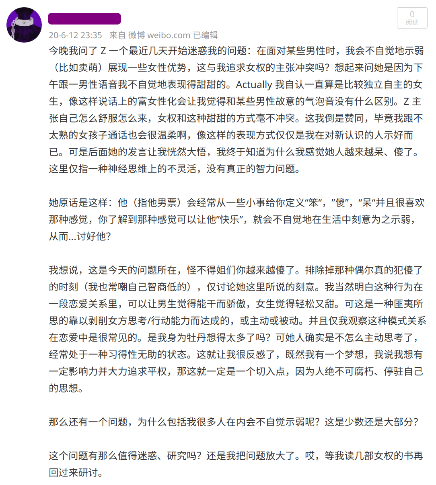

今天跟高中朋友解释微博为什么被封号了，翻起了之前的内容，发现这篇“迷惑”正好是两年前的今天写的，看了下是很稚嫩，反观这七百多天我本人也并没有什么明显的成长，徒增马齿。但是我不会因此而耻于分享出来，能表达能让他人看见总是好的。

前文如上截图所示。两年了，我还是没有想通，只是现在看起来免觉当时站着说话不腰疼，因为对身边部分女性朋友那种“你们都醉我独醒”的优越感，就轻易去猜测，去下定义做推论。与此同时，我却根本没有资格，首先分不清“装傻示弱”究竟是为人的自由还是男权社会下为女的悲哀，我后来并没有看书去研究。我还是每天花很多时间照镜子，把自己穿得花里胡哨才出门，也想不通那发色究竟是为彰显“看，我多么自由开放”还是为外界的眼光追风而染。我同情那些因社会性不公在日复一日琐事中最终变得mad人们会说她“神经质的”家庭妇女，却难以和自己的妈妈亲近言和。在春节聚会里，成年很久却依旧不敢站出来愤怒地对男人说：你们可不可以去厨房帮点忙！不要老打牌，少喝酒！（meanwhile 我在坐享其成嗷嗷待哺）最痛苦的是，在这样的环境下，我从始至终很难说真正放弃了对“浪漫爱”会降临到自己身上的想象，用那个流行的词——祛魅，沉浸在偶像剧磕 cp 的快乐的那个人是我，放弃幻想接受事实的这个人也是我。

一个很可笑的事实是，我几乎从小就表现得像个“女权主义者“，在男同学要帮我搬有一定重量的东西时我拒绝，那是因为**我害怕开始有交集后周遭八卦的小屁孩起哄**，被大人发现；从来都跟身边的男生界限划清不欠人情，那是因为我觉得这样很有个性，思想品德书上教我不自立的人**不会受到别人的尊重喜欢**。有一年春晚贾玲和另一位苗条的女演员表演了主题是“女神与女汉子”的小品，那时我根本没接触什么女权思想，但隐隐感到不适（即使这是创作和表演都来自于在喜剧界艰难站稳脚跟的女性作品），那… 也有一定原因是因为**我胖矮，投射在那个小品里，我会是那个女汉子** 。以上强烈的个人主义，维护得小心翼翼，也就是说，如果我足够幸运有机会，我十分愿意选择当瞩目的被爱的拿尽一切好处的那一个。背负在各种嫉妒中的成长，这其实就是厌女，要承认、修正这一切太难。
前几天唐山发生的无差别打人事件，朋友圈以前从不讨论相关问题的女性朋友也开始转发，相当一部分是对这种事件的无助恐惧情绪、对黑社会竟还存在的难以置信；另一部分把视角放在亟待反抗的几千年女性受压迫事实之下的探讨，少了很多。我不会说这些观念在朋友圈的转发不重要，装睡的人叫不醒。这一定是重要的，多一个人看到就多一份凝聚的力量。我有的时候想到种种问题，走在路上都不自觉地捏紧拳头，无数次告诉自己要理性，要像钢铁一般五毒不侵。如果我有一丝丝歇斯底里的情绪暴露，那就满足这个男权社会对女性的规训，正中他们所编造女的“就是情绪不稳定”之下怀了。

出于我是个异性恋的事实，也出于我短期离不开这片沼泽地的事实，双重叠加让人生困惑蒙上了一层厚重的窗帘，拍打一下，灰尘簌簌而落，那是对光明渴望无声的呐喊。同样的问题两年前我在反思，今天我依旧在反思，不见明显的成长，一定程度上是工作以后我对自己的要求降低了。如果说今天有什么对自己的期望：别再为自己的人生郁郁悲哀，不要那样了。投入抗争中，为这社会的不公、黑暗———去揭露、改变哪怕一点点。

<!-- 我今天把头发染黑了，黑得有些不正常，比原本的发色还要黑。不是想说要剥夺女性拾掇自己头发颜色的自由，我把它染黑正是今天对自己身体选择的自由。但我自身以后很少会再这样去做了，耗费时间、化学物质有害。我要投入那些对生命自由有益的呐喊! -->
