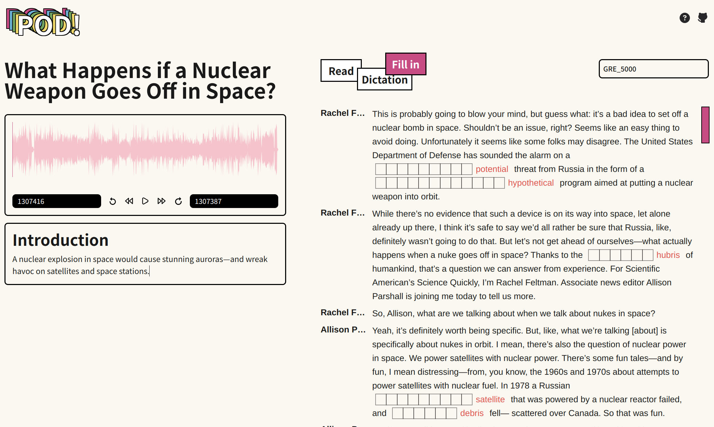
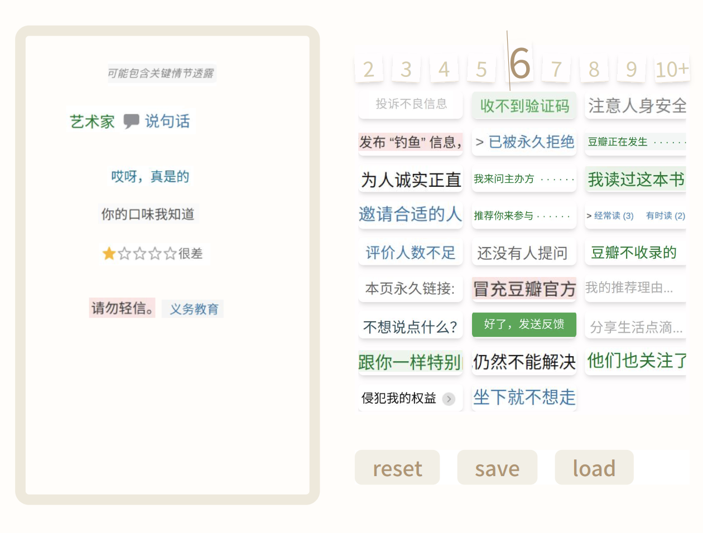

大家好，我是一名工作三年的前端工程师，在后端工作一年后转岗到前端（问就是不喜欢 :P ），所以也会些 Web 服务端的事情。现在想寻一些有相同想法的姐妹做些有意义（没意义也可以）的项目，核心的点是 **偏轻量，有创意，好玩的，女性主义** 的应用。

因为不太想为服务器支出开销和费心力去维护后端服务的稳定，**尽量做一些纯前端应用**吧，如果真的有需要的我们再考虑动态网页这个事情。

### 我可以提供

如果你不是很会 React 但是想 contribute，你已经有一点前端基础了，比如会搭环境，会 Github ，懂 HTML + CSS + JavaScript 三件套。我可以提供为你开发功能进行免费协助和答疑（北京时间晚 20:00 - 22:00 )

1. 前提是自己具有一定的动手和探索能力，带着问题现象描述和你已经探索的可能性来询问，会降低很多无效沟通的可能性
2. 想参与但是完全没有前端基础的话，很推荐 MDN 的这个教程： [学习 Web 开发](https://developer.mozilla.org/zh-CN/docs/Learn) 进行一些入门。发现新增的这个 [curriculum](https://developer.mozilla.org/en-US/curriculum/) 也非常不错

### 我需要你提供

1. 如果你有做一个产品的经验，可以提供一些具有可操作性的 idea
2. 如果你是一个苛刻的用户，可以对现有项目提改进建议，分享你的用户体验
3. 如果你是设计师
   1. 可以为我们想做的产品提供一份原型图或一份设计稿
      - 勿过于天马行空，实现成本太高
   2. 也可以为产品提供一个 logo 或一组 icon
4. 如果你接触过 Web 开发，具有调试能力，可以参与到项目的开发中来

### 一些进行时的项目

1. [Pod!](https://r.piggy.lol/pod/)
   前段时间高强度学英语的时候，发现很多优质的音频&文本材料，就在想自己做一个 Web 应用来帮助充分利用这些资源，于是就有了这个项目。我先从 BBC 和 Scientific American 上扒下来一些源数据，用自己想要的方式做了一些功能：填空，听写和阅读这三种模式。还导入了常见词表包括：AWL 580，GRE 5000 等等。
   

2. [Collage Poem Maker](https://r.piggy.lol/collage-poem/)
   主体是一个 canvas 画板 + 从豆瓣网页上截图的图片作为物料，玩法是随机摘取拼成一首诗歌。（非常简陋，还有非常多的功能都没做）

   

### 一些畅想中的项目

本人阅读过的文学作品不多，下面很多都是随口一说，不具有实际意义。需要具有文化底蕴或会系统化做一个产品的姐妹对这些 idea 进行进一步的探索展开。且 “虚拟迷宫” 和 “3d 房间” 这些概念看上去也似乎不是那么好实现。

1. 阿加莎作品探索迷宫

   - 用户在一个虚拟迷宫中探索，迷宫的不同区域对应阿加莎作品中的不同场景或章节
   - 在探索过程中，用户会遇到线索，解答这些谜题可以进入新的区域
   - 除文字介绍，可以加入音频、电影片段、插图等多媒体内容，增加用户的沉浸感
   - 提供与阿加莎作品相关的背景资料和历史事件

2. 一间只属于自己的房间

   1. 界面上是一个房间，伍尔夫在不同的晨昏时分伏案写作
   2. 用户在房间内探索，不同的墙面上或桌面上，用户点击后会展示伍尔夫的作品 / 生平故事

3. 其余任何什么好玩儿的应用，只要是在实现范围内的均可以

期待你的回复！如果 >= 3 个人联系我（通过邮箱: anigiscur@gmail.com），等我觉得一个 team 的角色都配备了之后会拉一个 slack 群组然后我们在里面进行后续的讨论。工作之余时间有限不能及时回复的话还请见谅。
