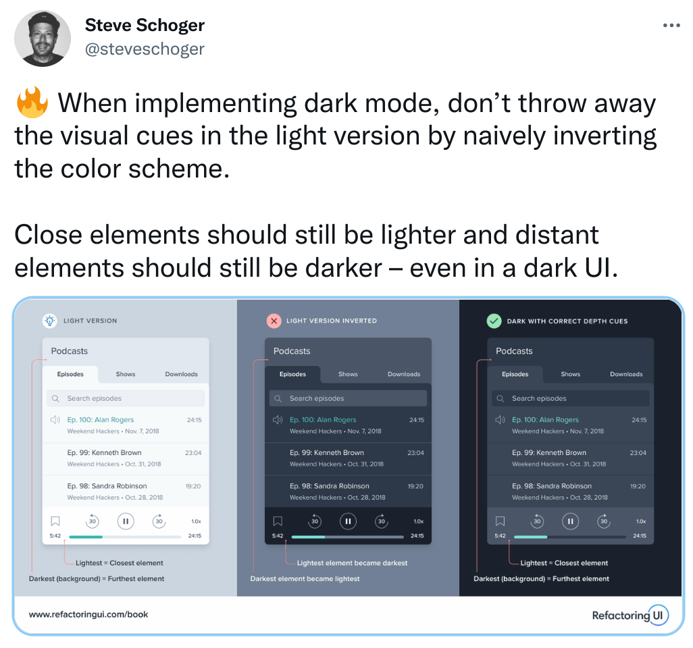

### 前言

我很喜欢博客使用着的这个主题：[paper](https://github.com/random-yang/paper)，现在很多流行的主题太“动态”了，这个简约又不会太简单。但是也有几个想加以改造的地方，比如：

1. 首页右边快速导航栏并没有 sticky
2. 黑暗模式的处理过于粗暴，夜间模式下的主题色太扎眼。其余区域对比度又很单一，没有层次感。有点伤眼睛
    - 改进更人性化的夜间模式
    - 自设定主题色
3. 总体比较适合文字的书写，对技术型博客相对不太适合
    - 优化一下 code bolck 的样式
    - 使代码块支持一键复制
4. 最上方的导航只有`首页`，也许我要放个 About Me
5. 全局搜索
    - 文章多了以后这个还挺重要

### 改造

#### 1. `sticky` 首页导航栏

position:sticky 这好像是 CSS 里一个比较新的特性，以前做吸顶都是用的 position:fixed。我照着 [css-position-sticky](https://www.digitalocean.com/community/tutorials/css-position-sticky) 这个教程把几个属性放到 sidebar 和 main 上面去就可以了。原理并没有特意去弄明白它....

#### 2. 优化黑暗模式的处理方式

搜了一些黑暗模式的[处理](https://css-tricks.com/a-complete-guide-to-dark-mode-on-the-web/)，挺有趣的。还发现了一个网站 https://refactoringui.com 好像很不错... 有空要系统性地学习一下 UI

#### 3. 优化代码块的样式
#### 4. About Me
#### 5. 全局搜索

