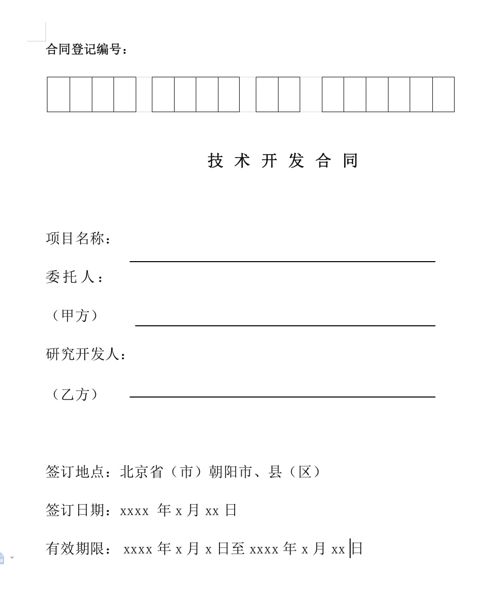
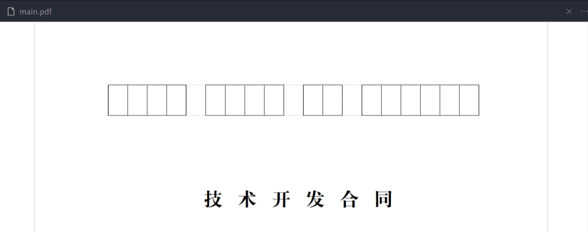

### 起因

最近收到了写技术合同（也叫软著）的任务，据说是可以减税，看了一眼之前的范例，发现这... 基本没有排版可言啊（也可能是我电脑上没有标准的 docx 查看器，用 google doc 打开是乱的），大家都是各写各的，令人惊奇的是这么多公司、学校在写的玩意，官方也并没有发标准的排版格式，和论文比起来美观度差很多。

所以就想着.. 嗯！这个合同格式看上去也不是很难，不如写一个 latex 版的玩一玩。上次用 latex 是毕业的时候在 overleaf 套着别人的填填写写，还挺简单的。这次也许涉及到自己创建 cls 等等，我并不希望在这上面花太多时间，所以画图之类我会选择直接从 figma 等之类的软件手动绘图，而不是用 latex 的排版功能。


## Let's start it

### 环境

- XeTeX 3.14159265-2.6-0.999992 (TeX Live 2020/Debian)
   - 才发现 latex 的版本号是近似 π ，很 nerd 也很浪漫呢！ 
- VS Code + LaTex Workshop Extension

### 0. 字体


长期使用 Linux 的话，由于没有什么参照物，有一些问题自己会注意不到。比如字体，感觉我电脑看见的所有 docx 文件因为种种原因都变了形，文件排版质感都很差。（装个 windows 虚拟机可以看到原始的吗？）不过幸好 wps 还保留着字体的名字 simsun，并且我通过多方（飞书在线文档、online docx to pdf）比对后确认是少了这个宋体。

```sh
wget https://files-cdn.cnblogs.com/files/xiaochina/simsun.zip
unar simsun.zip
sudo cp simsun.ttc /usr/share/fonts/
cd /usr/share/fonts/

sudo chmod 644 simsun.ttc
sudo mkfontscale
sudo mkfontdir
sudo fc-cache -fsv
```

安装好以后就可以看到能称之为“正常”的文档啦~

### 1. 封面

首先是这个封面，本身长得对排版要求很低...




#### 1.1 合同登记编号

先完成最上角几个框框。对 Latex 一无所知，用 latex rectangle grid 作为关键词搜到了 tikz 这个库，首先是需要在主文件中加上 `\usepackage{tikz}`，然后画框框

```tex
  % 宽高比都是随手调的，没有硬性限制
\begin{tikzpicture}[xscale=0.8,yscale=1.256]
  % 先画左边四个连续的黑框
  \draw[black,very thin] (0,0) grid (4,1);
  % 间隔 1*1 个格子画下个 4*1
  % 也可以用灰色虚线画一个间隔
  % \draw[gray,thin,dashed,dash pattern=on 1pt off 2pt] (4,0) grid +(1,1);
  \draw[black,thin] (5,0) grid +(4,1);
  % 后续就都是类似的了
  \draw[black,thin] (10,0) grid +(2,1);
  \draw[black,thin] (13,0) grid +(6,1);
\end{tikzpicture}
```
画出来差不多长这样（左上角的字和细节后面再调）：



#### 1.2 标题与主信息填写

可以看到剩下的分为三部分：
1. `技术开发合同` 总标题 
2. 三个需要在横线上填写的信息 
3. 最后的地点和日期

